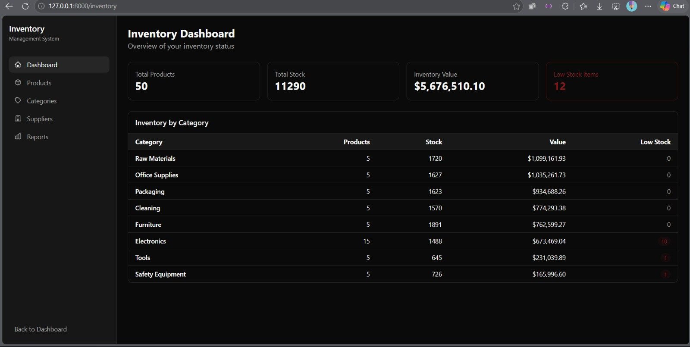
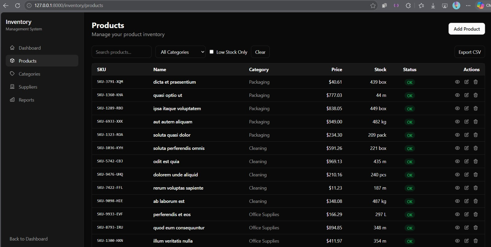
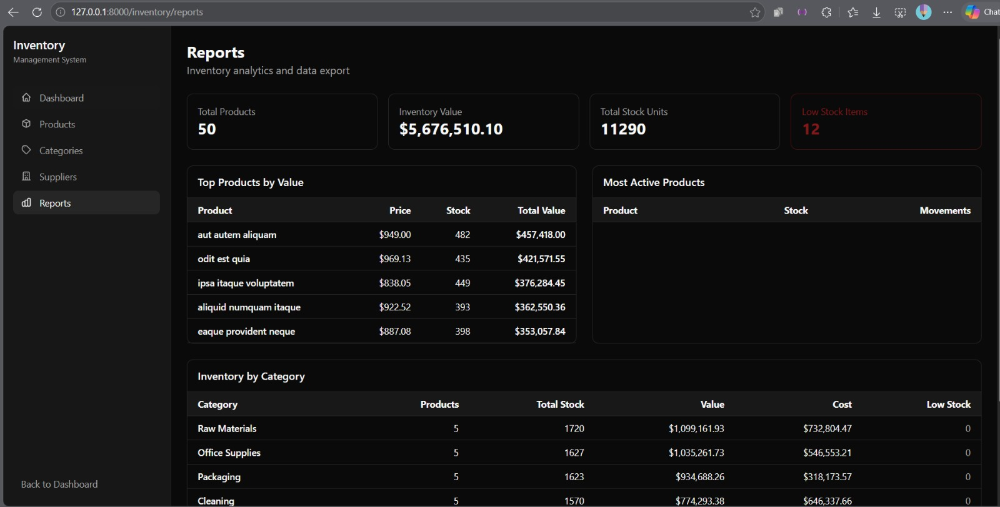

# Inventory Management System

A full-stack inventory management system built with Laravel, Vue, React/Inertia, and Tailwind CSS. The project is designed as a portfolio-ready example of authenticated business software with role-based access, stock tracking, analytics, CSV export, and background jobs.

## Features

- Product, category, and supplier management
- Stock movement tracking for stock in, stock out, and adjustments
- Inventory dashboard with total stock, inventory value, and low-stock counts
- Product search, category filtering, low-stock filtering, and CSV export
- Role-based access control for admin, manager, and staff users
- Analytics reports using raw SQL aggregation queries
- Laravel Fortify authentication with profile, password, email verification, and two-factor security screens
- Background job and Artisan command for low-stock checks
- Responsive dark UI for dashboard and inventory workflows

## Tech Stack

| Layer | Technology |
| --- | --- |
| Backend | Laravel 13, PHP 8.3+ |
| Auth | Laravel Fortify |
| Inventory UI | Vue 3, Vue Router, Pinia, Axios |
| App Shell/Auth UI | React 19, Inertia.js |
| Styling | Tailwind CSS v4 |
| Database | SQLite for local development, MySQL-ready |
| Tooling | Vite, Pest, PHP Pint, ESLint, Prettier |

## Screenshots






## Local Setup

### Requirements

- PHP 8.3+
- Composer
- Node.js 20+
- SQLite or MySQL

### Installation

- Find your desired location folder
- Open command prompt in the folder
- Paste this command

```bash
git clone https://github.com/Hamzahxvi/inventory-management-system.git
cd inventory-management-system

composer install
npm install

cp .env.example .env
php artisan key:generate

php artisan migrate --seed
npm run build
```

Start the development servers:

```bash
composer run dev
```

Open:

```text
http://127.0.0.1:8000
```

On Windows PowerShell, if `npm` is blocked by execution policy, use `npm.cmd`:

```powershell
npm.cmd run build
```

## Default Users

After running the database seeders, use these accounts:

| Email | Password | Role |
| --- | --- | --- |
| admin@example.com | password | Admin |
| manager@example.com | password | Manager |
| staff@example.com | password | Staff |

## Main Routes

| URL | Description |
| --- | --- |
| `/dashboard` | Main authenticated dashboard |
| `/inventory` | Inventory analytics dashboard |
| `/inventory/products` | Product list, search, filters, export |
| `/inventory/categories` | Category management |
| `/inventory/suppliers` | Supplier management |
| `/inventory/reports` | Inventory reports |

## API Overview

All inventory API routes require authentication.

| Method | Endpoint | Description |
| --- | --- | --- |
| GET | `/api/products` | List and filter products |
| POST | `/api/products` | Create product |
| GET | `/api/products/{product}` | Show product details |
| PUT | `/api/products/{product}` | Update product |
| DELETE | `/api/products/{product}` | Delete product |
| POST | `/api/products/{product}/movements` | Record stock movement |
| GET | `/api/categories` | List categories |
| GET | `/api/suppliers` | List suppliers |
| GET | `/api/reports/inventory-summary` | Inventory summary report |
| GET | `/api/reports/top-products` | Top products report |
| GET | `/api/export/csv` | Export product CSV |

## Project Structure

```text
app/
  Console/Commands/DispatchLowStockCheck.php
  Http/Controllers/Api/
  Http/Middleware/RoleMiddleware.php
  Http/Requests/
  Http/Resources/
  Jobs/CheckLowStock.php
  Models/

resources/js/
  pages/                 React/Inertia pages
  components/            React shell components
  vue/
    InventoryApp.vue
    router.ts
    layouts/
    stores/
    components/

routes/
  web.php
  api.php
```

## Quality Checks

Run the full check suite:

```bash
composer ci:check
```

Individual checks:

```bash
php artisan test
npm run build
npm run lint:check
npm run types:check
composer lint:check
```

## Portfolio Notes

This project demonstrates:

- Building a real CRUD workflow with Laravel controllers, requests, resources, and models
- Mixing React/Inertia authentication screens with a Vue inventory SPA
- Role-based authorization for business operations
- SQL reporting and aggregation
- Queueable background jobs
- A practical dashboard UI for repeated business use
- Automated formatting, linting, type checking, and tests

## Deployment Notes

For production:

```bash
npm run build
php artisan migrate --force
php artisan config:cache
php artisan route:cache
php artisan view:cache
```

Recommended hosting options:

- Laravel Forge
- Render
- Railway
- VPS with Nginx and PHP-FPM

## License

MIT
